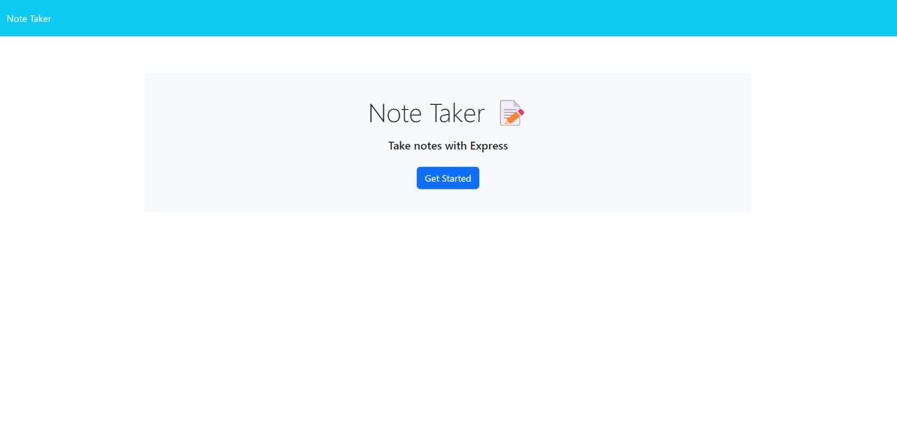
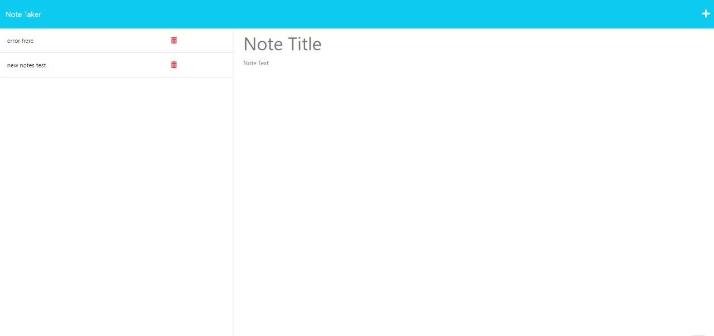

# Note Taker

## Description

This application allows the user to input notes as well as a title for each note and save them. Saved notes appear in the left hand sidebar and if clicked on will be displayed in the main note section. Unwanted notes can also be deleted with the provided delete button. This app made use of Node.js, Express.js and javascript to create the front and backend of the application. It has been deployed using Heroku.

## Table of Contents

- [Installation](#Installation)
- [Usage](#Usage)
- [Example](#Example)
- [Contributors](#Contributors)
- [Deploy](#Deploy)
- [Questions](#Questions)

## Installation

```
npm install
npm start
```

## Usage

```md
AS A small business owner
I WANT to be able to write and save notes
SO THAT I can organize my thoughts and keep track of tasks I need to complete
GIVEN a note-taking application
WHEN I open the Note Taker
THEN I am presented with a landing page with a link to a notes page
WHEN I click on the link to the notes page
THEN I am presented with a page with existing notes listed in the left-hand column, plus empty fields to enter a new note title and the note’s text in the right-hand column
WHEN I enter a new note title and the note’s text
THEN a Save icon appears in the navigation at the top of the page
WHEN I click on the Save icon
THEN the new note I have entered is saved and appears in the left-hand column with the other existing notes
WHEN I click on an existing note in the list in the left-hand column
THEN that note appears in the right-hand column
WHEN I click on the Write icon in the navigation at the top of the page
THEN I am presented with empty fields to enter a new note title and the note’s text in the right-hand column
```

## Example





## Contributors

Kenny

## Deploy

Website: [NoteTaker](https://note-taker-kenny-b0199278a909.herokuapp.com/)

## Questions

For additional questions, contact me at the email provided below.

- GitHub: [NoteTaker](https://github.com/KennyZhang12138/note-taker/tree/main)
- Heroku: [NoteTaker](https://dashboard.heroku.com/apps/note-taker-kenny)